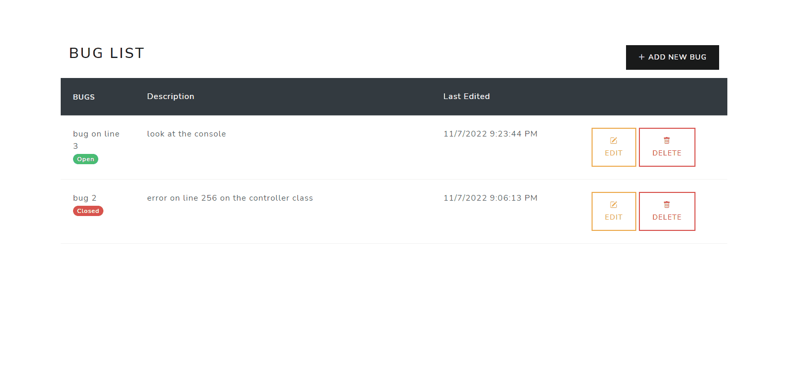
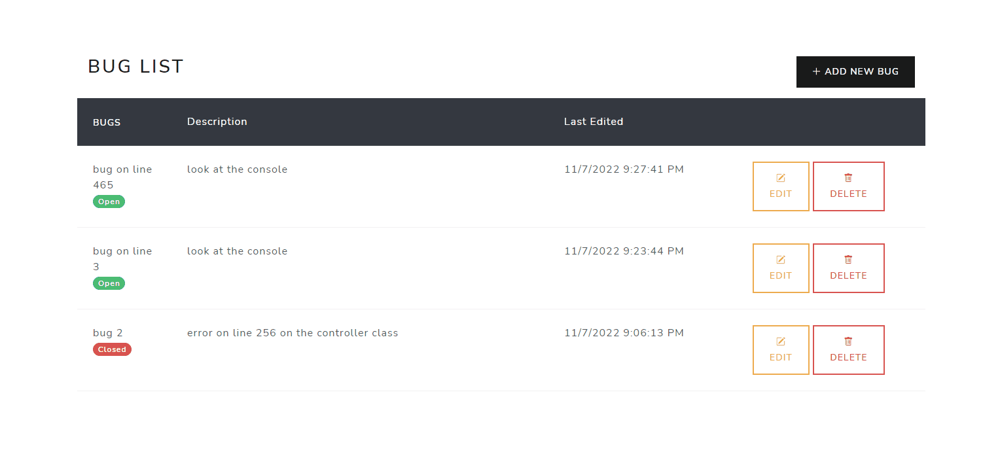
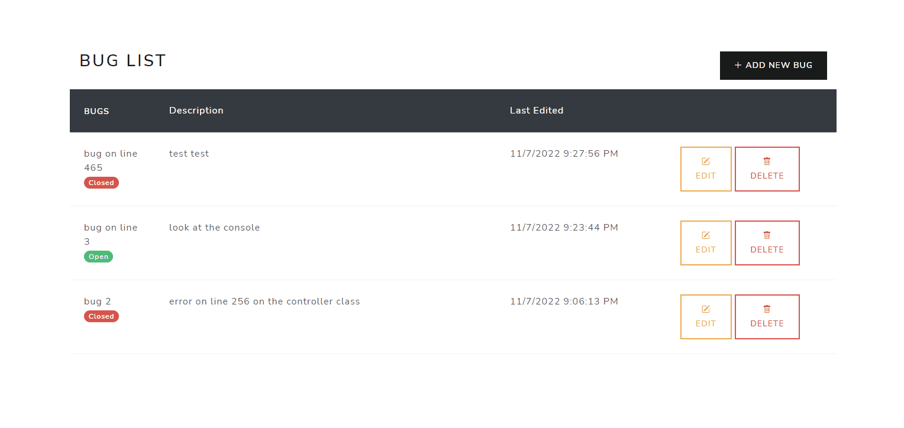

# BugTracker
 **Bug Tracker app created using C# and .NET 6 + Entity Framework + Razor Pages + Bootstrap + SQL as a database**

Requires SQL access to run

Uses the MVC (model-view-controller) pattern along with a CRUD (create-read-update-delete) model.

Includes a search bar that searches time, title, and description.

Create:

Update:

Delete:

Search:

